# 🏋️ Fitness Reasoning RL Agent

[](https://opensource.org/licenses/MIT)
[](https://www.python.org/downloads/)
[](https://github.com/OpenPipe/ART)
[](https://github.com/langchain-ai/langgraph)
[](https://github.com/psf/black)
[](https://github.com/astral-sh/ruff)

A reinforcement learning agent trained to create personalized fitness plans (nutrition and workouts) using **Agent Reinforcement Training (ART)** with verifiable rewards.

## 🎯 Overview

This project trains an AI agent using reinforcement learning to generate personalized daily meal plans that:
- Match user-specific macro targets (calories, protein, carbs, fats)
- Respect dietary restrictions and preferences
- Use real recipes from a vector database (RAG)
- Follow proper JSON schema for downstream integration

The agent is built with:
- **[OpenPipe ART](https://github.com/OpenPipe/ART)**: Agent Reinforcement Training framework
- **LangGraph**: Agent orchestration and ReAct pattern implementation
- **Pinecone**: Vector database for recipe and exercise retrieval
- **Verifiable Rewards**: Automated scoring based on macro accuracy and schema validation

## ✨ Features

- 🎯 **Personalized Nutrition Planning**: Creates daily meal plans tailored to individual macro targets
- 🔍 **RAG-Based Recipe Search**: Retrieves real recipes with accurate nutritional information
- ✅ **Verifiable Rewards**: Automated reward calculation without LLM-as-judge
- 🧠 **Reinforcement Learning**: Trains agents to improve planning quality over time
- 📊 **Weights & Biases Integration**: Track training metrics and model performance
- 🛠️ **Flexible Configuration**: Easy-to-customize training parameters and agent behavior

## 🔧 Requirements

- **Python**: 3.10 or higher
- **GPU**: NVIDIA GPU recommended (T4 or better) for training
- **API Keys**:
  - OpenAI API key
  - Pinecone API key
  - W&B API key (optional, for logging)

## 📦 Installation

### Quick Start (Recommended)

The easiest way to get started is using the provided `train_rl.sh` script, which handles environment setup automatically:

```bash
# Clone the repository
git clone https://github.com/yourusername/fitness-reasoning-rl-agent.git
cd fitness-reasoning-rl-agent

# Create a .env file with your API keys
cat > .env << EOF
OPENAI_API_KEY=your_openai_key_here
PINECONE_API_KEY=your_pinecone_key_here
WANDB_API_KEY=your_wandb_key_here  # Optional
EOF

# Run training (the script will install dependencies automatically)
bash train_rl.sh --env-file .env --data-file fitness_scenarios.jsonl
```

### Manual Installation

If you prefer to set up the environment manually:

```bash
# Install uv (fast Python package manager)
curl -LsSf https://astral.sh/uv/install.sh | sh

# Create virtual environment
uv venv .venv
source .venv/bin/activate

# Install dependencies
uv pip install -e .
uv pip install \
  "openpipe-art[backend,langgraph]>=0.4.11" \
  langchain-core>=0.3.0 \
  langgraph>=0.2.0 \
  langchain-openai>=0.2.0 \
  pinecone-client>=5.0.0 \
  litellm>=1.0.0 \
  datasets>=2.14.0 \
  pandas>=2.0.0 \
  numpy>=1.24.0 \
  tenacity>=8.2.0 \
  tqdm>=4.65.0 \
  weave
```

## 🚀 Usage

### Training the Agent

#### Using the Shell Script (Recommended)

```bash
bash train_rl.sh \
  --env-file .env \
  --data-file fitness_scenarios.jsonl \
  --log-dir ./logs
```

#### Using Python Directly

```bash
# Set environment variables
export OPENAI_API_KEY=your_key
export PINECONE_API_KEY=your_key
export WANDB_API_KEY=your_key  # Optional

# Run training
python train.py
```

### Configuration

Edit `src/config.py` to customize training parameters:

```python
@dataclass
class ModelConfig:
    base_model: str = "Qwen/Qwen2.5-7B-Instruct"  # Base LLM
    name: str = "fitness-agent-langgraph-4B-qwen3-001"
    max_seq_length: int = 8192
    temperature: float = 1.0

@dataclass
class TrainingConfig:
    groups_per_step: int = 2          # Parallel groups
    num_epochs: int = 30              # Training epochs
    rollouts_per_group: int = 4       # Rollouts per scenario
    learning_rate: float = 1e-5
    max_steps: int = 30

@dataclass
class AgentConfig:
    max_turns: int = 30               # Max agent reasoning steps
    recipe_search_top_k: int = 5      # Recipes to retrieve
```

### Data Format

Training data should be in JSONL format (`fitness_scenarios.jsonl`):

```json
{
  "id": "scenario_1",
  "question": "Create a daily meal plan for me...",
  "daily_cal_target": 2300,
  "daily_prot_target": 136,
  "daily_carb_target": 100,
  "daily_fat_target": 50,
  "dietary_preferences": ["no eggs", "no shellfish"]
}
```

## 📁 Project Structure

```
fitness-reasoning-rl-agent/
├── src/
│   ├── agent/
│   │   ├── rollout.py           # Agent execution logic
│   │   └── tools.py             # Agent tools (recipe search, etc.)
│   ├── env/
│   │   ├── verifiers_utils.py   # Reward verification helpers
│   │   └── verifiable_rewards/  # Reward calculation modules
│   │       ├── nutrition_rewards.py
│   │       ├── workout_rewards.py
│   │       └── schema_rewards.py
│   ├── training/
│   │   └── trainer.py           # Main training loop
│   ├── config.py                # Configuration settings
│   ├── data_loader.py           # Data loading utilities
│   ├── models.py                # Pydantic models
│   └── services.py              # External services (Pinecone, etc.)
├── data/
│   └── joint_exercises_metadata.csv  # Exercise metadata
├── fitness_scenarios.jsonl      # Training scenarios
├── train.py                     # Main training script
├── train_rl.sh                  # Training launcher script
├── main.py                      # Testing/demo script
└── pyproject.toml              # Project dependencies
```

## 🧠 How It Works

### System Architecture


### Agent Execution Flow

```mermaid
flowchart TD
    Start([User Request]) --> Parse[Parse User Requirements<br/>Macros, Diet, Preferences]
    Parse --> Plan[Plan Daily Meals<br/>Breakfast, Lunch, Dinner, Snacks]
    Plan --> Search1{Recipe Search<br/>Meal 1}
    Search1 --> |Query Pinecone| Recipe1[Get Recipe + Macros]
    Recipe1 --> Search2{Recipe Search<br/>Meal 2}
    Search2 --> |Query Pinecone| Recipe2[Get Recipe + Macros]
    Recipe2 --> SearchN[... More Meals ...]
    SearchN --> Sum[Sum Daily Macros]
    Sum --> Check{Within ±5%<br/>of Target?}
    Check --> |No| Adjust[Adjust Portions<br/>or Swap Recipes]
    Adjust --> Search1
    Check --> |Yes| Build[Build JSON Response]
    Build --> Validate{Valid Schema?}
    Validate --> |No| Fix[Fix Structure]
    Fix --> Build
    Validate --> |Yes| Return([Return Final Answer])
    
    style Start fill:#e8f5e9
    style Return fill:#e8f5e9
    style Check fill:#fff4e1
    style Validate fill:#fff4e1
    style Search1 fill:#e1f5ff
    style Search2 fill:#e1f5ff
```



### Reward Calculation


### 1. Agent Architecture

The agent uses a **ReAct (Reasoning + Acting)** pattern implemented with LangGraph:

- **Tools Available**:
  - `recipe_semantic_search`: Retrieves recipes from Pinecone vector DB
  - `return_final_answer_tool`: Returns the final meal plan

- **Agent Flow**:
  1. Receives a user request with macro targets
  2. Plans a daily meal structure
  3. Searches for real recipes for each meal
  4. Adjusts portions to match macro targets (±5% tolerance)
  5. Returns a structured JSON meal plan

### 2. Verifiable Rewards

Unlike traditional RL where rewards come from LLM judges, this project uses **verifiable rewards**:

```python
# Reward Components:
nutrition_score = verify_daily_meal_plan_macros(
    plan, cal_target, prot_target
)  # Macro accuracy

schema_score = verify_meal_plan_schema(plan)  # JSON validity

total_reward = 0.75 * nutrition_score + 0.25 * schema_score
```

Benefits:
- ✅ Deterministic and reproducible
- ✅ No LLM judge costs
- ✅ Fast evaluation
- ✅ Directly aligned with task requirements

### 3. Training Loop

```python
for each training step:
    1. Sample scenarios from dataset
    2. Run multiple rollouts per scenario
    3. Calculate verifiable rewards
    4. Update model using GRPO (Group Relative Policy Optimization)
    5. Log metrics to Weights & Biases
```

### 4. RAG Integration

- **Pinecone Indexes**:
  - `syntrafit-recipes`: Recipe database with nutritional info
  - `syntrafit-exercises`: Exercise database with metadata

- **Retrieval**: Agent queries Pinecone with meal ideas and gets real recipes with accurate macros

## 📊 Training Metrics

The agent tracks:
- **Reward**: Weighted combination of nutrition and schema scores
- **Macro Accuracy**: How close plans are to target macros
- **Schema Validity**: Percentage of valid JSON outputs
- **Tool Usage**: Recipe search efficiency

## 🔬 Development

### Running Tests

```bash
# Run a single scenario test
python main.py
```

### Creating Synthetic Data

```bash
python src/data_utils/create_synthetic_data.py
```

### Linting and Formatting

```bash
# Format code
black .

# Lint code
ruff check .

# Type checking
mypy src/
```

## 🤝 Contributing

Contributions are welcome! Please:

1. Fork the repository
2. Create a feature branch (`git checkout -b feature/amazing-feature`)
3. Commit your changes (`git commit -m 'Add amazing feature'`)
4. Push to the branch (`git push origin feature/amazing-feature`)
5. Open a Pull Request

## 📝 Citation

If you use this project in your research, please cite:

```bibtex
@software{fitness_reasoning_rl_agent,
  title = {Fitness Reasoning RL Agent},
  author = {Your Name},
  year = {2024},
  url = {https://github.com/yourusername/fitness-reasoning-rl-agent}
}
```

## 📄 License

This project is licensed under the MIT License - see the [LICENSE](LICENSE) file for details.

## 🙏 Acknowledgments

- [OpenPipe ART](https://github.com/OpenPipe/ART) for the RL training framework
- [LangGraph](https://github.com/langchain-ai/langgraph) for agent orchestration
- [Pinecone](https://www.pinecone.io/) for vector database
- [Weights & Biases](https://wandb.ai/) for experiment tracking

## 🔒 Security

### API Keys

**Never commit API keys to version control!**

- Create a `.env` file locally (see `.env.example`)
- Add `.env` to `.gitignore` ✅ (already configured)
- Use environment variables for all sensitive data
- Rotate API keys regularly
- Use minimal required permissions for each key

```bash
# ✅ Good: Use .env file
export OPENAI_API_KEY=$(cat .env | grep OPENAI_API_KEY | cut -d'=' -f2)

# ❌ Bad: Don't hardcode in code
api_key = "sk-xxx..."  # Never!
```

### Reporting Security Issues

If you find a security vulnerability:

1. **Don't** open a public issue
2. Email: security@example.com with:
   - Description of vulnerability
   - Steps to reproduce
   - Potential impact
3. We'll respond within 48 hours

## 📂 Documentation

- **[README.md](README.md)** - Project overview and usage guide
- **[CONTRIBUTING.md](CONTRIBUTING.md)** - Contribution guidelines
- **[TROUBLESHOOTING.md](TROUBLESHOOTING.md)** - Common issues and solutions
- **[CHANGELOG.md](CHANGELOG.md)** - Version history and roadmap
- **[LICENSE](LICENSE)** - MIT License

## 📞 Support

For questions or issues:
- 📖 Check [TROUBLESHOOTING.md](TROUBLESHOOTING.md) first
- 🐛 [Open an issue on GitHub](https://github.com/SOCAIT/SOAR-fitness-agent-rl/issues)
- 📧 Email: giannispast9@gmail.com

## 🌟 Star History

If you find this project helpful, please consider giving it a star! ⭐

## 👥 Citation

If you use this project in your research or article, please cite:

```bibtex
@software{fitness_reasoning_rl_agent,
  title = {Fitness Reasoning RL Agent: Personalized Nutrition Planning with Verifiable Rewards},
  author = {Ioannis Pastellas},
  year = {2025},
  url = {https://github.com/SOCAIT/SOAR-fitness-agent-rl},
  note = {Agent Reinforcement Training with LangGraph and Pinecone}
}
```

---

**Built with ❤️ using Reinforcement Learning and LLMs**

*Last Updated: November 2024*

